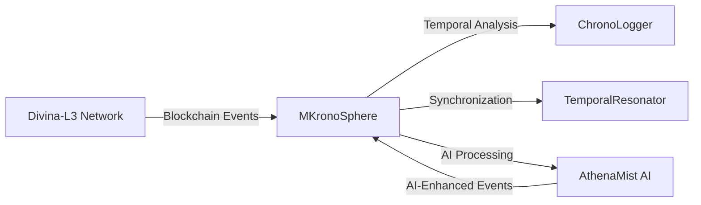

# Divina-L3 Network Integration Design

## Overview
This document outlines the integration between MKronoSphere and the Divina-L3 Gaming Blockchain, focusing on real-time event processing and temporal synchronization.

## Integration Architecture

### 1. Network Connection
- **Protocol**: Web3/WebSocket
- **Components**:
  - Smart Contract Event Listeners
  - Blockchain Node Connection
  - Transaction Monitoring

### 2. Key Integration Points
- **Smart Contract Events**: Game state changes, asset transfers
- **Blockchain Operations**: Transaction monitoring, block time synchronization
- **AI Service Integration**: AthenaMist AI event processing

### 3. Data Flow

## Implementation Plan

### Phase 1: Blockchain Connection
1. Set up Web3 provider
2. Implement contract event listeners
3. Create basic event handlers

### Phase 2: Event Processing
1. Parse blockchain events
2. Map to temporal events
3. Implement Sacred Time correlations

### Phase 3: AI Integration
1. Connect to AthenaMist AI
2. Implement AI event processing
3. Set up feedback loops

## Performance Considerations
- Event batching for high throughput
- Caching for frequently accessed data
- Asynchronous processing for non-critical events

## Security Model
- Secure key management
- Transaction signing security
- Rate limiting and DDoS protection

## Next Steps
1. Finalize smart contract ABIs
2. Set up testnet connection
3. Implement core event listeners

---
*Last Updated: 2025-07-27*
