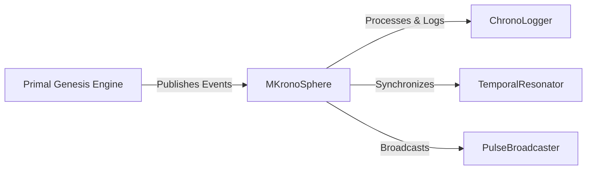

# Primal Genesis Engine Integration Design

## Overview
This document outlines the integration between MKronoSphere and the Primal Genesis Engine, focusing on temporal event synchronization and orchestration.

## Integration Points

### 1. Authentication & Connection
- **Protocol**: OAuth 2.0 / API Keys
- **Endpoints**:
  - `POST /api/v1/auth/token` - Obtain authentication token
  - `GET /api/v1/system/status` - Check system status

### 2. Event Types
- **Temporal Events**: Game state changes, player actions
- **System Events**: Maintenance, updates, alerts
- **Cosmic Events**: Aligned with Sacred Time calculations

### 3. Data Flow

## Implementation Plan

### Phase 1: Core Connection
1. Implement authentication module
2. Set up event listeners
3. Create basic event handlers

### Phase 2: Event Processing
1. Implement event parsing
2. Add temporal correlation
3. Set up error handling

### Phase 3: Advanced Features
1. Add event filtering
2. Implement retry logic
3. Add monitoring

## Error Handling
- **Transient Errors**: Automatic retry with exponential backoff
- **Permanent Errors**: Log and alert
- **Data Validation**: Strict schema validation

## Security Considerations
- All API calls must be authenticated
- Sensitive data must be encrypted
- Rate limiting and throttling

## Next Steps
1. Finalize API specifications
2. Implement core connection module
3. Set up development environment

---
*Last Updated: 2025-07-27*
